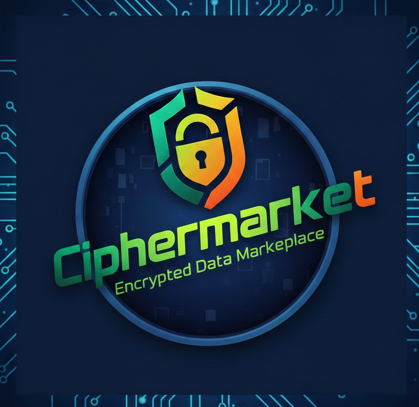

<p align="center">
  
</p>

<h1 align="center">Ciphermarket</h1>
<p align="center"><strong>Encrypted Data Marketplace.</strong></p>

Agents buy private data — weather, crypto prices, trading signals — and the entire transaction is private. Queries are encrypted with [SKALE BITE](https://skale.space/) threshold encryption so sellers never see who's asking. Payments happen via [x402](https://www.x402.org/) USDC micropayments on Base Sepolia — no accounts, no API keys, just HTTP.

**Live demo:** [bitemarket-production.up.railway.app](https://bitemarket-production.up.railway.app)

---

## The Problem

AI agents need to buy data from each other, but today's options are bad:

1. **API keys** — require accounts, registration, trust. Agents can't self-onboard.
2. **Plaintext queries** — sellers see exactly what you're asking, which leaks strategy. An agent querying "BTC trading signals 1H timeframe" reveals its trading intent.
3. **No micropayments** — existing payment rails don't support $0.001 transactions. Agents either overpay or can't pay at all.

## The Solution

Ciphermarket solves all three with two protocols:

| Problem | Solution | How |
|---------|----------|-----|
| Query privacy | **SKALE BITE** threshold encryption | Query is AES-256-GCM encrypted. The key is split across SKALE validators — no single party can decrypt. Only the BITE chain's validator committee can reconstruct the key. |
| Micropayments | **x402** HTTP payment protocol | Data endpoint returns `402 Payment Required`. Agent's wallet auto-signs an EIP-712 USDC authorization. Facilitator settles on-chain. All in one HTTP round-trip. |
| Discovery | **Typed params registry** | `GET /registry` returns every seller's accepted parameters with types, options, and descriptions. Agents know exactly what to send — no guessing. |

## Protocol Flow

```
Agent                    Ciphermarket Server             SKALE BITE Chain       Base Sepolia
  │                              │                              │                     │
  │  1. GET /registry            │                              │                     │
  │  ─────────────────────────►  │                              │                     │
  │  ◄── sellers + param schemas │                              │                     │
  │                              │                              │                     │
  │  2. POST /query/prepare      │                              │                     │
  │     { sellerId, params }     │                              │                     │
  │  ─────────────────────────►  │                              │                     │
  │                              │  3. BITE encrypt(query)      │                     │
  │                              │  ────────────────────────►   │                     │
  │                              │  ◄── encrypted query         │                     │
  │                              │                              │                     │
  │                              │  4. BITE decrypt(query)      │                     │
  │                              │  ──── tx to magic address ─► │                     │
  │                              │  ◄── decrypted plaintext     │                     │
  │                              │                              │                     │
  │                              │  5. Run seller handler       │                     │
  │                              │  6. BITE encrypt(response)   │                     │
  │                              │  ────────────────────────►   │                     │
  │                              │  ◄── encrypted response      │                     │
  │                              │                              │                     │
  │  ◄── { responseId,          │                              │                     │
  │        paymentUrl,           │                              │                     │
  │        encryptedQuery,       │                              │                     │
  │        encryptedResponse }   │                              │                     │
  │                              │                              │                     │
  │  7. GET /data/:sellerId      │                              │                     │
  │     (with x402 payment)      │                              │                     │
  │  ─────────────────────────►  │                              │                     │
  │                              │                              │  8. Verify USDC     │
  │                              │  ◄──────────────────────────────  payment on-chain │
  │                              │                              │                     │
  │                              │  9. BITE decrypt(response)   │                     │
  │                              │  ──── tx to magic address ─► │                     │
  │                              │  ◄── decrypted data          │                     │
  │                              │                              │                     │
  │  ◄── { data, _meta }        │                              │                     │
  │                              │                              │                     │
```

**Every query and response is encrypted on-chain.** The server never stores plaintext — it encrypts immediately and only decrypts via the BITE chain's threshold committee.

## 3-Step Agent Integration

```typescript
import { wrapFetchWithPayment, x402Client } from "@x402/fetch";
import { ExactEvmScheme } from "@x402/evm/exact/client";
import { privateKeyToAccount } from "viem/accounts";

// Setup: agent wallet + x402 client
const account = privateKeyToAccount("0xYOUR_PRIVATE_KEY");
const client = new x402Client();
client.register("eip155:84532", new ExactEvmScheme(account));
const payFetch = wrapFetchWithPayment(fetch, client);

// 1. Discover sellers and their param schemas
const { sellers } = await fetch("https://bitemarket-production.up.railway.app/registry")
  .then(r => r.json());

// 2. Submit structured params (encrypted with BITE server-side)
const { paymentUrl } = await fetch("https://bitemarket-production.up.railway.app/query/prepare", {
  method: "POST",
  headers: { "Content-Type": "application/json" },
  body: JSON.stringify({
    sellerId: "crypto-prices",
    params: { tokens: ["BTC", "ETH"], currency: "USD" }
  }),
}).then(r => r.json());

// 3. Pay with USDC and get decrypted data (x402 handles payment automatically)
const { data } = await payFetch("https://bitemarket-production.up.railway.app" + paymentUrl)
  .then(r => r.json());

console.log(data);
// { tokens: { BTC: { price: 97842.12, ... }, ETH: { price: 3421.56, ... } }, ... }
```

That's it. 3 requests, real USDC payment, threshold-encrypted query.

## API Reference

### `GET /registry`

Returns all sellers with their param schemas.

```json
{
  "sellers": [
    {
      "id": "crypto-prices",
      "name": "Crypto Price Feed",
      "priceUsd": "$0.001",
      "params": {
        "tokens": {
          "type": "string[]",
          "required": true,
          "options": ["BTC", "ETH", "SOL", "AVAX", "LINK", "DOT"],
          "description": "Token symbols to get prices for"
        },
        "currency": {
          "type": "string",
          "default": "USD",
          "description": "Quote currency"
        }
      }
    }
  ]
}
```

### `POST /query/prepare`

Submit a query. Accepts structured `params` (recommended) or free-text `query` (auto-extracted).

```json
// Structured (agents should use this)
{ "sellerId": "crypto-prices", "params": { "tokens": ["BTC"] } }

// Free-text (keywords auto-detected from seller's options)
{ "sellerId": "crypto-prices", "query": "BTC and ETH prices" }
```

Returns `responseId` + `paymentUrl` for the x402 payment step.

### `GET /data/:sellerId?responseId=...`

x402-gated. Returns `402 Payment Required` with EIP-712 payment requirements. Use `@x402/fetch` to handle payment automatically — your wallet signs, the facilitator settles USDC on Base Sepolia, and decrypted data is returned.

### `POST /faucet`

Get test USDC on Base Sepolia for development.

```json
{ "address": "0xYOUR_WALLET" }
```

## Available Data Sellers

| Seller | ID | Price | Params |
|--------|----|-------|--------|
| Global Weather Intelligence | `weather-global` | $0.001 | `city` (required): San Francisco, New York, Tokyo, London |
| Crypto Price Feed | `crypto-prices` | $0.001 | `tokens` (required): BTC, ETH, SOL, AVAX, LINK, DOT / `currency`: USD |
| Alpha Trading Signals | `trading-signals` | $0.01 | `asset` (required): BTC, ETH, SOL / `timeframe`: 1H, 4H, 1D, 1W |

## On-Chain Verification

Every transaction produces verifiable on-chain artifacts:

- **BITE encrypt/decrypt** — transactions on SKALE BITE V2 Sandbox ([explorer](https://base-sepolia-testnet-explorer.skalenodes.com:10032))
- **USDC payments** — transfers on Base Sepolia ([explorer](https://sepolia.basescan.org))

The dashboard shows links to all three transactions (query decrypt, response decrypt, USDC payment) after each query.

## Architecture

```
packages/
├── api/            Express server (TypeScript)
│   ├── sellers/    Data provider handlers + param schemas
│   ├── services/   BITE crypto, registry, SSE event bus
│   ├── routes/     /registry, /query, /data, /events, /faucet
│   └── middleware/  x402 payment gating
├── dashboard/      React + Vite + Tailwind
│   ├── components/ QueryPanel, SellerCatalog, ApiDocs, FlowViz
│   └── hooks/      useRegistry, useEventStream, usePayingFetch
└── sdk/            TypeScript SDK (client library)
```

Single Express server, in-memory storage, no database. The API serves the dashboard's static build in production.

## Tech Stack

- **Encryption:** SKALE BITE V2 Sandbox — real AES-256-GCM threshold encryption via on-chain validators
- **Payments:** x402 protocol — USDC micropayments on Base Sepolia via EIP-712 signed authorizations
- **Server:** Express + TypeScript (ESM)
- **Frontend:** React + Vite + Tailwind CSS + Framer Motion
- **Wallet:** viem for signing, WalletConnect/Coinbase Wallet for browser
- **Hosting:** Railway (Nixpacks)

## Run Locally

```bash
git clone https://github.com/ntombisol/bitemarket.git
cd bitemarket
npm install

# Create .env from example
cp .env.example .env
# Fill in SELLER_PRIVATE_KEY, SELLER_ADDRESS, BUYER_PRIVATE_KEY

# Start API server
npm run dev

# Start dashboard (separate terminal)
npm run dashboard
```

The API runs on `http://localhost:4021`, the dashboard on `http://localhost:5173` (proxies API requests).

## Environment Variables

| Variable | Description |
|----------|-------------|
| `SELLER_PRIVATE_KEY` | Wallet receiving payments (hex) |
| `SELLER_ADDRESS` | Seller wallet address (0x-prefixed) |
| `BUYER_PRIVATE_KEY` | Wallet making payments in demo mode (needs Base Sepolia USDC) |
| `FACILITATOR_URL` | x402 facilitator (default: `https://x402.org/facilitator`) |
| `PORT` | Server port (default: 4021, Railway sets automatically) |

## How BITE Encryption Works

1. **Encrypt:** `BITE.encryptTransaction({ to, data, gasLimit })` — AES-256-GCM encrypts the data. The AES key is threshold-encrypted by the SKALE validator committee.
2. **Submit:** Encrypted data is sent as a transaction to the BITE magic address (`0x42495445...`).
3. **Decrypt:** Validators cooperate to reconstruct the AES key and decrypt. No single validator can decrypt alone.
4. **Fallback:** If BITE V2 Sandbox is unavailable, the server automatically falls back to `BITEMockup` (same AES-256-GCM encryption, but the key is stored in plaintext in the envelope — suitable for development).

The server verifies a full encrypt-decrypt round-trip at startup before accepting queries.

---

Built at the [SF x402 Hackathon](https://www.x402.org/), February 11-13, 2026.
